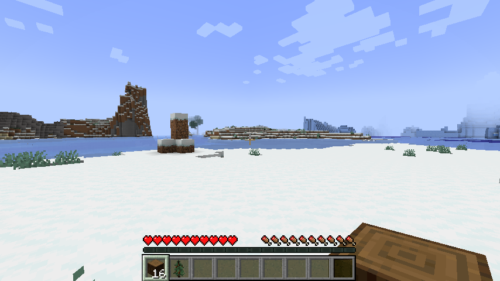
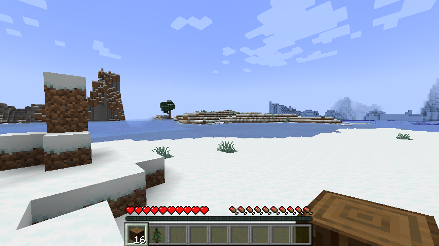
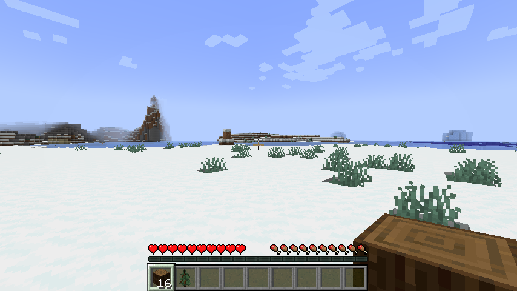
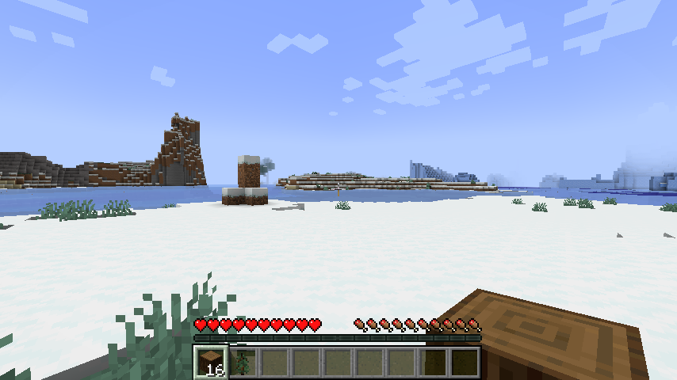
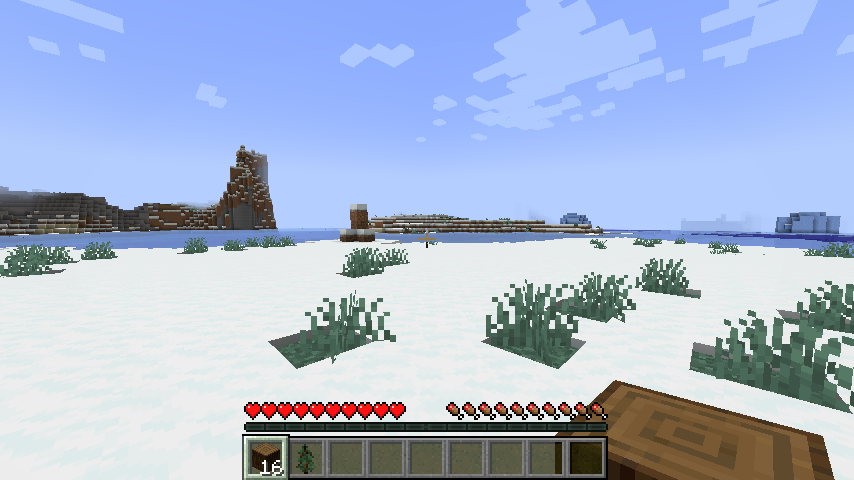
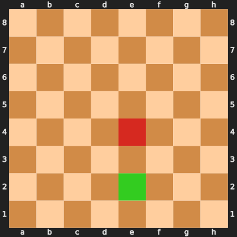
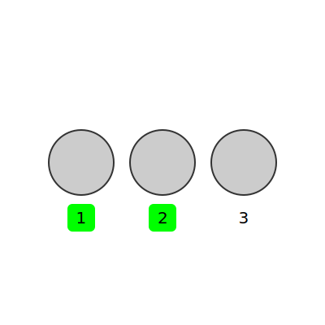

# MET-Bench: Multimodal Entity Tracking for Evaluating the Limitations of Vision-Language and Reasoning Models (ICML 2026)

[Paper](https://arxiv.org/abs/2502.10886) · [Project page](https://vanyacohen.com/MET-Bench/) · **🤗 HuggingFace Datasets:** [Minecraft](https://huggingface.co/datasets/vanyacohen/MET-Bench-Minecraft) · [Chess](https://huggingface.co/datasets/vanyacohen/MET-Bench-Chess) · [Shell Game](https://huggingface.co/datasets/vanyacohen/MET-Bench-Shell)

🤗 [Raw Minecraft trajectories](https://huggingface.co/datasets/vanyacohen/MET-Bench-Minecraft-Trajectories): 462 trajectories containing 462,235 observations with screenshots, game-state telemetry, and recorded controls and actions.

## Setup

Evaluate models on MET-Bench using an OpenAI-compatible API or a local Hugging Face model. The default evaluation uses ten-action sequences for Chess and Shell Game and next-state prediction tasks for Minecraft.

Use Python 3.10 or newer. Clone the repository and install the dependencies:

```bash
git clone https://github.com/vanyacohen/MET-Bench.git
cd MET-Bench
python -m venv .venv
source .venv/bin/activate
pip install -r requirements.txt
```

For local 🤗 Hugging Face models:

```bash
pip install -r requirements-hf.txt
```

## Evaluate an API model

Set `OPENAI_API_KEY` in your environment, then run:

```bash
python evaluate.py run \
  --model gpt-5.6-sol \
  --temperature omit \
  --reasoning-effort low \
  --output results/gpt-5.6-sol
```

Credentials are read from the environment.

For another OpenAI-compatible provider:

```bash
python evaluate.py run \
  --model PROVIDER_MODEL_ID \
  --base-url https://openrouter.ai/api/v1 \
  --api-key-env OPENROUTER_API_KEY \
  --token-parameter max_tokens \
  --workers 4 \
  --output results/provider-model
```

The image evaluations require a model and endpoint that accept multiple image inputs. `--temperature omit` supports endpoints that manage temperature themselves; `--reasoning-effort` passes the requested reasoning setting to compatible APIs. `--max-tokens` controls the output budget, including reasoning tokens for providers that count them against that limit.

To check your API configuration with two examples per domain and modality:

```bash
python evaluate.py run --model gpt-5.6-sol --temperature omit --reasoning-effort low --limit 2 --output results/quick-check
```

## Evaluate a 🤗 Hugging Face model

For a vision-language model:

```bash
python evaluate.py run \
  --backend hf \
  --model Qwen/Qwen3.5-4B \
  --hf-task vlm \
  --output results/qwen3.5-4b
```

For text-only evaluation with the same model:

```bash
python evaluate.py run \
  --backend hf \
  --model Qwen/Qwen3.5-4B \
  --hf-task vlm \
  --modalities text \
  --output results/qwen3.5-4b-text
```

Set `HF_TOKEN` in your environment to access gated Hugging Face models.

Use `--domains minecraft chess shell` to select domains and `--modalities text` or `--modalities image` to select inputs. Run `python evaluate.py run --help` for all options.

## Results and resume

A run writes:

- `config.json`: the run configuration.
- `<domain>-selection.json`: the ordered evaluation sample.
- `<domain>-<modality>.jsonl`: responses, targets, completion status, token usage, and any request errors.
- `summary.json`: scores for each domain and modality.

Resume an interrupted run by repeating the same command and output directory with `--resume`. Successful responses are reused and failed requests are retried. Use the same configuration when resuming.

Rescore saved responses without calling the model:

```bash
python evaluate.py score results/gpt-5.6-sol/chess-text.jsonl
```

## Tests

```bash
python -m unittest discover -s tests -v
```

## Examples

### Minecraft

**Action:** `Walk forward 8 blocks`

**Initial state:**



| Choice 1 | Choice 2 |
|---|---|
|  |  |
| **Choice 3** | **Choice 4** |
|  |  |

**Correct choice: 1.** The initial state and all four candidates also have aligned JSON state representations for text-based evaluation. The action is given as text in both modalities.

### Chess and Shell Game

| Chess: `e2e4` | Shell Game: `1 swap 2` |
|---|---|
|  |  |

The Chess image encodes a move from the green square to the red square. The Shell Game image encodes a swap between the two green-labeled positions. In this Shell Game example, the ball starts at position **1** and moves to position **2**. Each image is paired with the text action shown above.

## Citation

```bibtex
@inproceedings{cohen2026metbench,
  title={MET-Bench: Multimodal Entity Tracking for Evaluating the Limitations of Vision-Language and Reasoning Models},
  author={Cohen, Vanya and Mooney, Raymond},
  booktitle={International Conference on Machine Learning},
  year={2026},
  url={https://arxiv.org/abs/2502.10886}
}
```

## License

[MIT](LICENSE).
